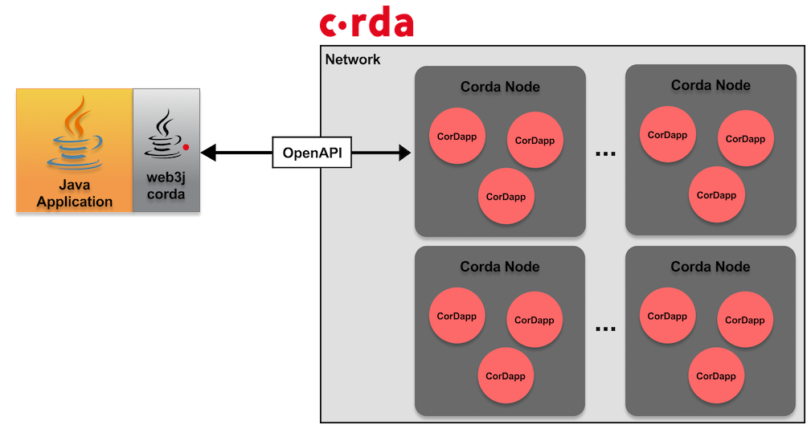

web3j integration for Corda
===========================

## Introduction

web3j-corda is a lightweight client library for working with CorDapps and interacting with different nodes on Corda network.



## Features
- [x] Connect to a Corda node.
- [x] Query the available CorDapps in the node.
- [x] Generate CorDapp wrappers to interact with the deployed CorDapps.
- [ ] Generate automated tests using Docker containers to verify the working of CorDapp. 
- [x] Commandline tools


## Quick start

A [web3j-corda sample project](https://gitlab.com/web3j/corda-samples) is available that demonstrates a number of core features of Cordapp using web3j-corda, including:
* Interact with a CorDapp listing its nodes and starting a flow.
* Generate automated tests using Docker containers to verify the working of CorDapp. 

## Getting started

Add the relevant dependency to your project:

### Maven

```xml
<dependency>
    <groupId>org.web3j</groupId>
    <artifactId>web3j-corda</artifactId>
    <version>0.1.0-SNAPSHOT</version>
</dependency>
```

### Gradle

```groovy
dependencies {
    implementation 'org.web3j:web3j-corda:0.1.0-SNAPSHOT'
}
```

## Connect to a Corda Node

To print all the nodes connected to the current node:

```kotlin
val service = CordaService("http://localhost:9000/") // URL exposed by BRAID service
val corda = Corda.build(service)
corda.network.nodes.findAll()
```

To query the list of all running CorDapps:

```kotlin
val service = CordaService("http://localhost:9000/") // URL exposed by BRAID service
val corda = Corda.build(service)
corda.corDapps.findAll()
```

To start a flow there are two option depending on whether you want to use a generated CorDapp wrapper
or just the Corda API directly:

### Using Corda API
This way works but is not type-safe, so can lead to runtime exceptions:
```kotlin
// Initialise the parameters of the flow 
val params = InitiatorParameters("$1", "O=PartyA, L=London, C=GB", false)

val issue = corda
    .corDapps.findById("obligation-cordapp")
    .flows.findById("issue-obligation")

// Type-conversions with potential runtime exception!
var signedTx = issue.start(parameters).convert<SignedTransaction>()
```

### Using the web3j CorDapp wrapper
By using a wrapper generated by the `web3j-corda` Command-Line Tool, 
you can interact with your CorDapp in a type-safe way:
```kotlin
// Initialise the parameters of the flow 
val params = InitiatorParameters("$1", "O=PartyA, L=London, C=GB", false)

// Start the flow with typed parameters and response
val signedTx = Obligation.load(corda).flows.issue.start(parameters)
```

## Command line tools

A web3j-corda jar is distributed with each release providing command line tools. 
The following functionality of web3j-corda is exposed from the command line:

* Generate a template CorDapp project and the respective client wrappers
* Generate client wrappers for existing CorDapps

### Using web3j-corda new command

To generate a template CorDapp project with the client wrappers: 

```shell script
web3j-corda new -n=<corDappName> -o=<output-dir> -p=<packageName>
```
### Using web3j-corda generate command

To generate a web3j-corda client wrappers to existing CorDapps: 

```shell script
web3j-corda generate (-u=<openApiUrl> | -d=<corDapps-dir>) -o=<output-dir> -p=<packageName>
```

